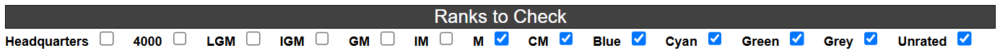

# codeforces-skipped-flagger

finds users with skipped contests and flags them

[**click to install**](https://github.com/temporary77/codeforces-skipped-flagger/raw/main/codeforces-skipped-flagger.user.js) (requires a userscript manager)

here is a demo (i use a dark theme but itll work for light themes as well)

## download instructions

1. install [Tampermonkey](https://tampermonkey.net/)
2. [**click this link**](https://github.com/temporary77/codeforces-skipped-flagger/raw/main/codeforces-skipped-flagger.user.js) to install the userscript

## config

this userscript has a config

you should be able to access it through your userscript manager menu

# configurable options
**NUM_CONTESTS**: how many recently participated contests itll check at max per person
unrated contests (heuristics, cpc mirrors, etc.) will also contribute to this number when checking

**START_CHECK**: number of submissions it starts calling for (itll call x, x, 2x, 4x, ... until it gets NUM_CONTESTS contests)
setting this number too high or too low will affect speed (api calls are not instant)
you usually dont have to tweak this number

**FLASH_CHECKED**: if true, after a name is checked itll flash

**FLASH_FLAGGED**: if true, flagged names will continuously flash a crimson color
if this is false, flagged names will retain their original color
to make them have crimson color, just set this to true and set FLASH_WINDOW to a big number

**FLASH_WINDOW**: time in miliseconds between flagged flashes

**SHOW_WARNING**: if true, a ⚠️ will be displayed after names that have been flagged

**SHOW_HOURGLASS**: if true, an ⏳ will be displayed after the name that its checking
from my experience the ⏳ is pretty annoying but you do you

**CONSOLE_LOGS**: if true, itll log stuff in console

**Ranks to Check**: you can also choose ranks to check

